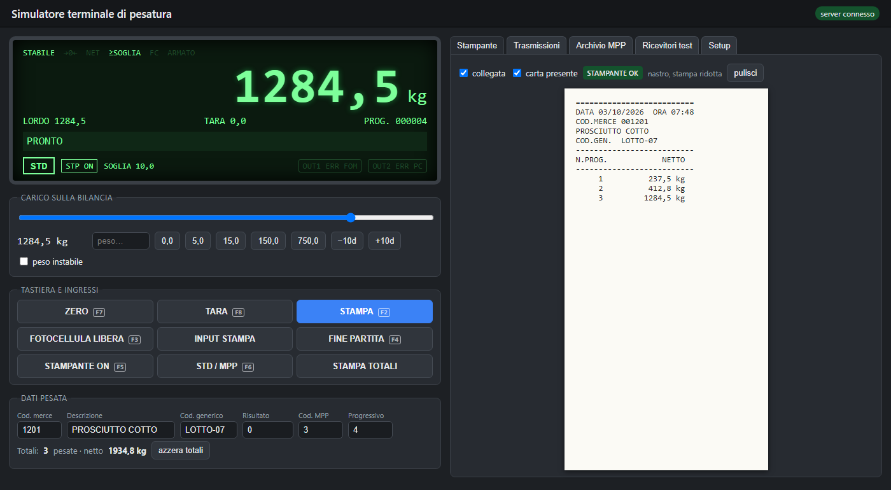

# Simulatore bilancia

🇬🇧 [English version](README.md) · 🇮🇹 Italiano

[](https://github.com/robycremo/simulatore-bilancia/actions/workflows/ci.yml)
[](LICENSE)


Simulatore di terminale di pesatura (Node.js + React) che invia la stringa peso su IP (TCP/UDP, ACK/NAK opzionale).


Serve a collaudare i software che ricevono le pesate (PC, FOM) senza la bilancia fisica.

## Avvio rapido

```bash
npm ci
npm run prod
```

Aprire http://localhost:3000. In sviluppo: `npm run dev` (UI su http://localhost:5173 con ricaricamento automatico).

## Installazione su PC di collaudo

### Requisiti

- Windows 10/11 (o Linux), **Node.js 22 o successivo** (https://nodejs.org, versione LTS).
- Porte libere: **3000** (interfaccia), **9100** e **9101** (ricevitori di test PC e FOM), **4001**/**4002** se i
  canali sono in modalità TCP server, più quelle dei sistemi da collaudare indicate nel setup.

### Installazione

1. Copiare la cartella del progetto sul PC (o clonare il repository).
2. In un terminale (PowerShell) nella cartella del progetto:

   ```powershell
   npm ci
   ```

### Avvio

```powershell
npm run prod
```

Compila l'interfaccia e avvia il simulatore; nel terminale compare l'indirizzo da aprire nel browser.
Per fermarlo: **Ctrl+C** nel terminale (lo stato viene salvato). Alle accensioni successive basta `npm start`.

Messaggi all'avvio:

| Messaggio | Causa e rimedio |
|---|---|
| `La porta 3000 è già in uso` | il simulatore è già avviato, oppure un altro programma usa la porta: chiuderlo o usare `PORT` |
| `Errore di configurazione: HOST=… impostare anche SIM_TOKEN` | si è chiesto l'accesso dalla rete senza token (vedi sotto) |

### Variabili d'ambiente

| Variabile | Default | Significato |
|---|---|---|
| `PORT` | `3000` | porta dell'interfaccia |
| `HOST` | `127.0.0.1` | interfaccia di ascolto della **pagina web**; `0.0.0.0` per aprirla da altri PC. Non riguarda le porte dei canali in TCP server (vedi *Uso con PuTTY*) |
| `SIM_TOKEN` | — | token di accesso, **obbligatorio** se `HOST` non è locale |

In PowerShell valgono per il terminale in cui vengono impostate:

```powershell
$env:PORT="3100"; npm start
```

### Accesso da un altro PC

```powershell
$env:HOST="0.0.0.0"; $env:SIM_TOKEN="scegliere-un-token"; npm start
```

Dall'altro PC aprire `http://<ip-del-pc-simulatore>:3000`: l'interfaccia chiede il token una volta per sessione del
browser. Al primo avvio Windows può chiedere di consentire Node.js nel firewall: autorizzare solo le **reti private**.
Il token non va scritto in file del progetto; chiudere il terminale a fine uso.

### Dati, log e diagnostica

| Percorso | Contenuto |
|---|---|
| `data/config.json` | setup del terminale (con copia `.bak` della versione precedente) |
| `data/state.json` | progressivo, totali, archivio MPP (con copia `.bak`) |
| `data/logs/simulatore-AAAA-MM-GG.log` | log giornaliero, una riga JSON per evento; conservato 14 giorni |
| `http://localhost:3000/api/health` | stato del simulatore e dei ricevitori di test |

Se `config.json` o `state.json` risultano danneggiati, all'avvio vengono rinominati `*.corrupt-<data-ora>` e il
simulatore riparte dalla copia `.bak` o dai valori di default; il log lo segnala con l'evento `storage_recovered`.

Eventi utili da cercare nel log: `weighing` (ogni pesata), `tx_error` (trasmissione fallita), `printer_fault`,
`auth_denied` (accesso rifiutato), `client_error` (errore dell'interfaccia).

### Ricevitore da riga di comando

Per guardare le stringhe da un altro PC, o al posto dei ricevitori integrati (prima fermare quello sulla stessa porta
dalla scheda *Ricevitori test*):

```powershell
npm run listen -- 9100 tcp ack
```

Argomenti: porta, `tcp` o `udp`, risposta `ack`, `nak` o `none`.

### Uso con PuTTY (modalità TCP server)

Di default il simulatore apre lui la connessione verso PC e FOM (TCP client). Per collegarsi **al** simulatore con
PuTTY o con un software che si aspetta una bilancia in ascolto, il canale va messo in modalità **TCP server**:

1. **Setup** → *7) Trasmissione a PC* (o FOM) → *Protocollo* = **TCP server**. Viene proposta la porta **4001**
   (PC) o **4002** (FOM); *Salva setup*. Lo stato del canale deve diventare `IN ASCOLTO TCP 4001`.
2. In PuTTY: *Host Name* `127.0.0.1`, *Port* `4001`, *Connection type* **Raw** → *Open*.
3. A ogni pesata PuTTY mostra la stringa (104 caratteri, 106 con checksum, terminata da CR). Sul display compare
   `PC: 1 client`.

Comportamento:
- fino a **5 client** per canale ricevono tutti le stesse stringhe; ciascuno riceve solo quelle successive al
  collegamento;
- quello che si scrive in PuTTY viene ignorato (salvo i caratteri ACK/NAK se il protocollo ACK/NAK è attivo);
- **nessun client collegato** = trasmissione fallita (`NESSUN CLIENT`): uscita di errore e, per il FOM con
  *totalizza solo con FOM corretta*, pesata non totalizzata, come per un PC irraggiungibile.

**Da un altro PC.** Con *Accesso* = "solo questo PC" (default) la porta non è raggiungibile dalla rete: PuTTY da un
altro PC riceve **"connection refused"** e nel log non resta nulla. Per collegarsi dalla rete:

1. *Accesso* = **rete (IP ammessi)** e in *IP ammessi* gli indirizzi dei PC autorizzati (separati da virgola, al
   massimo 20); *Salva setup*.
2. Al primo ascolto Windows può chiedere il permesso del firewall per Node.js: autorizzare solo le **reti private**.
3. Dall'altro PC: PuTTY *Raw* su `<ip-del-pc-simulatore>:4001`.

Un PC non in elenco viene disconnesso subito e il log registra `server_client_refused` con motivo `ip`.

> `HOST=0.0.0.0` serve solo ad aprire la **pagina web** da altri PC: non apre le porte dei canali, che dipendono
> esclusivamente da *Accesso* e *IP ammessi* nel setup.

## Tasti rapidi

F2 stampa · F3 fotocellula · F4 fine partita · F5 stampante on/off · F6 STD/MPP · F7 zero · F8 tara

## Come si modifica il progetto

Il progetto segue lo Spec Driven Development, con le regole della [costituzione](constitution.md):

```text
intent → spec → tech-requirements → plan → tasks → codice → test-results → PR
```

I documenti vivi sono [intent.md](intent.md), [spec.md](spec.md), [tech-requirements.md](tech-requirements.md) e
[plan.md](plan.md); ogni modifica ha la sua cartella in [changes/](changes/README.md) con i sei documenti.
`npm run check:flow` (eseguito anche in CI) verifica che il percorso sia rispettato.

| Comando | Effetto |
|---|---|
| `npm run dev` | server con riavvio automatico + Vite su :5173 |
| `npm run build` | compila l'interfaccia in `client/dist` |
| `npm start` | avvia il simulatore con l'interfaccia compilata |
| `npm run prod` | `build` + `start` |
| `npm test` | test automatici (i test su intestazioni e cache richiedono la build) |
| `npm run check:flow` | verifica struttura e stati delle change |

## Struttura

```text
server/
  index.js                 avvio: variabili d'ambiente, segnali di arresto, errori non gestiti
  app.js                   composizione: storage + log + motore + HTTP + WebSocket (createApp)
  config/env.js            PORT, HOST, SIM_TOKEN
  api/                     HTTP (sicurezza, cache, health), WebSocket (token, limiti), validazione comandi
  domain/                  motore di pesatura (engine.js), stringhe e checksum (format.js)
  transport/               canali PC/FOM (TCP client, UDP, TCP server) con ACK/NAK, ricevitori di test,
                           ricevitore da riga di comando
  storage/jsonStore.js     salvataggio atomico con .bak e recupero
  observability/logger.js  log JSON giornalieri
client/src/
  hooks/useEngine.js       connessione al motore, token, invii limitati del carico
  components/              display, comandi, pannelli, setup, errori, richiesta token
test/                      test node:test (unitari ed end-to-end)
data/                      setup, stato e log (non versionato)
changes/                   una cartella per ogni modifica (sei documenti)
scripts/check-flow.mjs     verifica del percorso
.github/                   CI e modello di pull request
```
